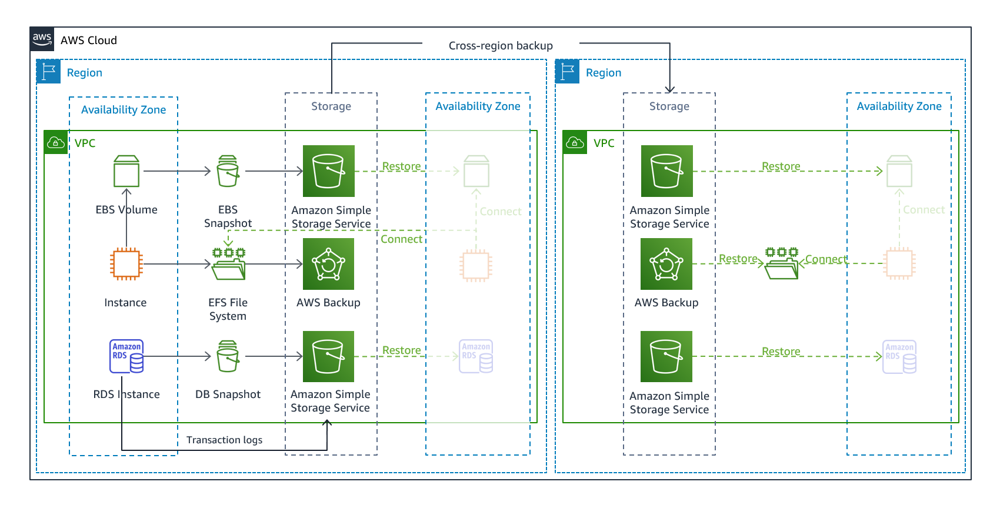
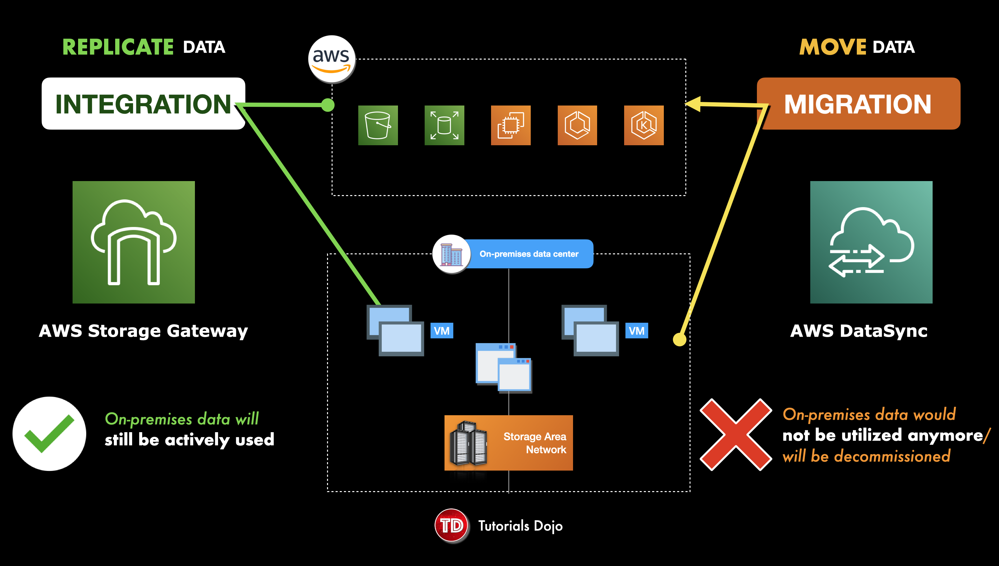

# Picture
The AWS Solutions Architect Associate (SAA-C03) exam covers a breadth of
topics, including the right choice of AWS services under different
conditions and constraints, setting up high-availability architectures,
disaster recovery, hybrid cloud models, networking/routing traffic in
different configurations, etc.

*Answering AWS SAA Questions*

Many questions on the exam start by presenting a situation and
identifying _constraints_ (e.g. a database must be stored on-prem, data
in transit must be encrypted) that help rule out answers that would
otherwise be viable. The question then usually asks to you select the
answer (an AWS service, feature, option, etc.) that _optimizes a
variable_ such as:

  * lowest cost (the question could be calling for serverless options
    such as Lambda or Athena. Don't forget build costs, not just
    operational costs!)
  * scalability (again serverless services such as Lambda come into play
    because of the ability to handle bursts of incoming traffic)
  * easiest / least effort
  * lowest operational complexity (this may be calling for managed
    services such as RDS)

This is meant to simulate the problems Solutions Architect face
day-to-day on the job. The design of an architecture has to optimize
certain variables and suffice constraints. 

*AWS Cloud Practitioner: A Prerequisite for AWS SAA?*
Although the AWS Cloud Practitioner certification is not a prerequisite
for the AWS SAA exam, I found it very helpful to study for the AWS Cloud
Practitioner, especially to learn the basics of the many AWS services.

## EC2 INSTANCES

*Billing period*
- only during running and when instance in stopping state preparing for hibernation only(not billed if instance does not have hibernation feature)
*300 Instance Types across 5 Instance Families*
- reserve instance always gets billed based on hour until end of contract regardless of state
  * AWS offers over 300 EC2 instance types
    across /5
    instance families/ (general purpose family, memory-optimized,
    storage-optimized, compute-optimized, and accelerated computing),
    each with varying resource and performance focuses
  * For example, within the compute-optimized family, you have C4
    instance types (running on Haswell chips) and more recent C5
    instance types (running on Skylake with Nitro system). 

*Instance Purchasing Options*

  * On-Demand Instances - the default option, for short-term ad-hoc
    requirements where the job can't be interrupted
  * On-Demand Capacity Reservations - the only way to reserve capacity
    for blocks of time such as 9am-5pm daily. Pros: reserve capacity, Cons: no billing discount vs on-demand(unless also have reserved instance plan), have to pay for the whole time of capacity reservation even if instances do not run. This is only supported with 
    - Capacity reservation is only supported with `On-Demand Capacity Reservations` and `Zonal Reserved Instances` plan, not `Regional Reserved Instances`, although `On-Demand Capacity Reservations` can be applied to `Regional Reserved Instances` but only guaranteed for an available zone.
    
  * ​Spot instance - highest discount potential (50-90%) but no
    commitment from AWS, could be terminated with 2min notice. Could use
    for grid and high-performance computing.
  * Reserved Instances - for long-term workloads, /1 or 3 year
    commitment/ in exchange for 40-60% discount
  * Saving plans, commitment to pay for number of compute per hour upfront to get discount. So even if the compute is not used it still gets charged
  * Dedicated Instances - run on hardware dedicated to 1 customer (more $$)
  * Dedicated Host - fully dedicated and /physically
    isolated/ server. Allows you to use your server-bound
    software licenses (e.g. IBM, Oracle) and addresses compliance and
    regulatory requirements and potentially reduce cost (note: billing
    is per-hour not per-instance)
  * Bare metal EC2 instance - for when the workload needs access to the
    hardware feature set (e.g. Intel hardware)

*Launching Instances*

  * *Configurations / Launch Templates* used to create new EC2 instances
    using stored parameters such as instance family, instance type, AMI,
    key pair and security groups. Auto-scaling groups can launch
    instances using config templates. You can't `edit` a launch config,
    but you can create a new one and point to it.
  * *User data* - pass up to 16KB of user data at launch that the
    instance can run on startup such as config scripts. Runs on Root User
  * *Instance metadata* (e.g. instance ID, hostname, events, security
    groups, public keys, network interfaces,) can be accessed via a
    direct URI or by using the /Instance Metadata Query Tool/
  * When you launch an EC2 instance into a default VPC, it has a public
    and private DNS hostname and IP address. When you launch in a
    non-default VPC, it may not have a public hostname depending on the
    DNS and VPC configs.
  * Errors when
    launching  include /InsufficientInstanceCapacity/, /InstanceLimitExceeded/
  * Instances terminate with no error if there are EBS problems (EBS
    volume limit, EBS snapshot is corrupt), or if the AMI you're
    launching from is missing a required part
  * Each EC2 instance that you launch has an associated *root device
    volume*, either EBS volume or an Instance Store volume (more these
    under Storage section below). You can use /block device mapping/ to
    specify additional EBS volumes or instance store volumes to attach
    to a live instance, attach additional EBS volumes to a running
    instance, but can't directly add additional Instance Store volumes.
  * *Run Command* - run from the AWS Management Console, CLI or SDK, to
    install software, execute Powershell commands and scripts,
    configuring Windows settings, on live EC2 instances. Required SSM VPC endpoint or NAT Gateway if EC2 stays in private subnet.

*Placement Groups*

  * **Cluster placement group** = packs instances close together inside an
    AZ to achieve low latency, high throughput - use for HPC
    - If receiving `insufficient capacity error`when adding new instances => underlying hardware capacity issue => stop and restart instances in the group as that allows moving instances to a different hardware that has capacity
  * **Partition placement group** = separate instances into logical
    partitions such that instances in one partition do not share
    hardware with instances in another partition. Gives you control and
    visibility into instance placement, but not great for performance.
    Used by large distributed workloads such as Hadoop.
  * **Spread placement group** =  place 1 or few instances each
    in distinct hardware to reduce correlated failures. Not great for
    performance

*Scaling Instances*

  * Lifecycle hooks: `Pending` for scale-out and `terminating` for scale-in
  * In high-availability contexts you use an *Auto-Scaling Group
    (ASG)* to automatically launch and stop instances, and an *Elastic
    Load Balancer (ELB)* to distribute traffic among the instances
      - *​*specify which subnets the ASG should launch instances into
      - **Attach Target Groups** to the ASG (actually ASG points to target group, 1 ASG can point to multiple target groups for multiple ports)
      - 1 target group points to 1 port
      - 1 listener points to 1 port
  * ASG **scaling policies**
      o ​**Simple** - maintain the # of instances, manually change the
        min-desired/max and attach/detach instances. similar to step scaling policies, except they're based on a single scaling adjustment, with a cooldown period between each scaling
      o **Scheduled** - scale based on a scheduled event or recurring
        schedule (e.g. if you know that you have traffic spike every
        morning at 9am)
      o **Dynamic** - scale in response to an event or alarm
      o **Step** - configure multiple changes to scaling based on multiple
        events. Warmup time can be added so instance is not counted as active until ready,but still counted against target scaling
        
        
      o **Target Tracking**- select a metric and a target value to represent the ideal average utilization or throughput level. This is similar to how a thermostat maintains a target temperature.
      o _NOTE: AWS recommends using target tracking over step scaling,
        and step scaling over simple scaling in most cases_

  * **Cooldown period**- reducing the cooldown period will more quickly
    terminate unneeded instances, reducing costs, used for simple scaling
  * **Enhanced networking** provides higher bandwidth, higher
    packet-per-second (PPS) performance, and lower inter-instance
    latency. Consider if PPS is maxed out.  
    Enhanced networking uses single root I/O virtualization (SR-IOV) which provides high performance networking capabilities on supported instance types.
    Without SR-IOV: Traffic from VMs goes through the hypervisor, which manages the communication between VMs and the physical NIC.

    With SR-IOV: VMs can have direct access to the physical NIC, bypassing the hypervisor for certain types of traffic
  * Scale-in 
*Custom Metrics(require CloudWatch Monitoring script written in PERL*
- Memory utilization
- Disk swap utilization
- Disk space utilization
- Page file utilization
- Log collection
  *** Enhanced monitoring is only available for RDS and not normal EC2 instances
  *** Detailed monitoring allows 1 min resolution rather than 5 min in standard one, but not used for custom metrics
_*VPC, SUBNETS, NETWORKING*_
  * default VPC: has public and private DNS, custom VPC: only has private DNS, need to enable DNS resolution and hostnames for public DNS
  * bastion host should stay on AWS VPC and on public subnet, only allowing specific sources, e.g. corporate IPs
  * A *VPC* is a virtual network that closely resembles a traditional
    network that you'd operate in your own data center.
  * After you create a VPC, you can add *subnets*. A subnet is a range
    of IP addresses in your VPC. After you add subnets, you can deploy
    AWS *resources* in your VPC.
  * Use *route tables* to determine where network traffic from your
    subnet or gateway is directed. 
  * A *gateway* connects your VPC to another network. For example, use
    an **internet gateway** to connect your VPC to the internet.
  * Use a *VPC endpoint *to connect to AWS services privately, without
    the use of an internet gateway or NAT device.
  * Use a *VPC peering* connection to route traffic between the
    resources in two VPCs.
  * Use a *Transit Gateway*, which acts as a central hub, to route
    traffic between your VPCs, VPN connections, and AWS Direct Connect
    connections. Transit Gateway is per region => Transit Gateway Network Manager for cross-region connectivity between transit gateways
    
    diff with VPN cloudhub: cloudhub connects multiple on-prem networks (VPN) to a VPC 
  * Connect your VPCs to your on-premises networks using *AWS Virtual
    Private Network (AWS VPN)*.
  * For IPv6, you can use an **Egress-only** internet gateway to allow 
    outbound only communition to the Internet over **IPv6**. It associates with private subnet
  * Network access analyzer: identify unintended network access to VPC
*Wavelength*
- a zone that includes 5G network, part of VPC. Apps on the zone runs within carrier network=> no to little hoop
  
- 
*Subnets*

  * A VPC is housed within a Region, and a subnet maps 1-to-1 with
    an AZ. Therefore, for high availability, you need at least **2 subnets**
    in your VPC so that you can span 2 AZs.
  * When you create a new subnet, it is automatically associated to the
    main route table. 
  * Example VPC/subnet configurations recommended by AWS:
      - VPC with single public subnet: e.g. for single-tier,
        public-facing web app such as a blog or a simple website
      - VPC with public and private subnets: e.g. for multi-tier web
        apps where the web servers are in the public subnet and the DBs
        in the private subnet

*Public Subnet vs. Private Subnet*

  * Public Subnets
      - _has a route table that routes to an Internet Gateway_ (note the
        Internet Gateway is attached to the VPC, not directly to the subnet)
      - When EC2 instances launched in a Public Subnet, they are
        auto-assigned a public IP address or ENI
      - Security groups and network ACLs on Public Subnet must allow SSH
        traffic (on port 22) for admin config.
  * Private Subnets
      - _outbound traffic is routed to a NAT device_. The NAT device is
        installed in the Public Subnet and connected to an Internet
        Gateway for outbound access to the internet. 
          + *NAT Gateway vs. NAT Instance* = NAT Gateway is managed for
            you by AWS and highly available, whereas NAT Instance is a
            lot more manual work but can be used as a bastion host /
            jump box​
      - EC2 instances _don't_ have public IP or ENI
      - You have to use a bastion host ("jump box") to access instances
        in the Private Subnet over SSH (port 22)

*VPC Endpoints*

  * *Interface endpoints***privately** connect your VPC to AWS services,
    services hosted by other AWS accounts, and supported AWS Marketplace
    services as if they were in your VPC 
      - powered by *AWS Privatelink*
      - applies to many AWS services (API Gateway, CloudFormation,
        CloudWatch, S3, EC2, System Manager, etc) 
      - _does not go over the internet_
      - no need to use an internet gateway, NAT device, DX connection,
        or VPN
      - Is an ENI with a private IP address, in the subnet that you
        specify, directing traffic to the service that you specify. Uses
        DNS to direct traffic to the service. Protected by a Security Group.
  * *Gateway endpoints* direct traffic to S3 or DynamoDB only, using
    private IP addresses.
      o Does not enable AWS Privatelink
      o You route traffic from your VPC to the gateway endpoint using
        route tables. Protected by VPC endpoint policies rather than
        Security Groups.
      S3 Gateway Endpoint:use VPC endpoint policies for access to trusted S3 buckets and not bucket policies as the latter will need to be added to all trusted buckets

*3 Types of Network Adapters*

 1. ENI - basic type
 2. ENA - for enhanced networking, high bandwidth and low latency
 3. EFA (fabric adapter) - for high performance computing(ML), bypassing hardware. ENA on steroid that helps OS-bypass on non-Windows server. If this is place on Windows server it acts as ENA only

*Security Groups vs. Network ACL (NACL)*

  * _Security Group is at the instance level, Network ACL is at the
    subnet level_ and applies to all instances within that subnet
  * Security Groups don't have deny rules, Network ACL have accept and deny
  * Security Groups are stateful, Network ACL stateless
  * Security Groups evaluate all rules together, Network ACL processes
    rules in order
  * Neither can block traffic by country
  * Security Groups have inbound allow rules allowing traffic from
    within the group, whereas custom security groups don't allow any
    inbound traffic by default. All outbound traffic is allowed by default.
  * Security Group default state: outbound rule allows all traffic to
    all IPs, but inbound has no rules and traffic therefore denied by
    default
  * NACLs function at the subnet level with separate allow/deny rules
    for inbound and allow/deny rules for outbound. They are stateless so
    it's all about what the rules say each time.  Don't apply -within-
    the subnet, only in/iout of the subnet.
  * Default security groups have inbound allow rules (from within the
    group). Custom security groups do not allow any inbound traffic. All
    outbound traffic is allowed.
  * VPC automatically comes with a default NACL which allows all
    inbound/outbound traffic. A custom NACL denies all inbound/outbound
    traffic by default.

*Amazon Route 53*

  * _Geolocation_ routing is by location of the
    user, _geoproximity_ routing is by proximity of the resources
  * weighted routing = split traffic by %
  * **Health check** = check the health of your resources and only return
    healthy resources in response to DNS queries
  * apply a **routing policy** such as latency, weighted, failover
  * Configurations
      - active/passive: in case of failure, return backup resource.
        Requires failover policy. Manual intervention can be required to
        then cause a fail-back to the active site. 
      - active/active: return >1 resource. Requires latency policy,
        weighted policy, or some other policy besides failover. In the
        case of failover, returns only the healthy resource
      - combination: multiple policies are combined into a tree for more
        complex DNS failover

*Routing Records*

  * Best practice is to use DNS names/URLs whenever possible rather than
    IP addresses. Some exceptions include pointing ELBs directly to the
    IP address of a peered VPC, or an on-prem resource linked via DX or
    VPN connection.
  * *[Alias records](
    https://docs.aws.amazon.com/Route53/latest/DeveloperGuide/resource-record-sets-choosing-alias-non-alias.html)* provide a Route 53–specific extension to DNS functionality.
      - They let you route traffic to selected AWS resources: ELBs,
        APIs, CloudFront distributions, S3 buckets, Elastic Beanstalk,
        VPC interface endpoints, etc.
      - Unlike a CNAME record, they also let you route traffic from one
        record in a hosted zone (usually the *zone apex* *naked domain name*, 
        such as "example.com") to another record (e.g.
        "www.example.com")
      - When Route 53 receives a DNS query for an alias record, it
        responds with 1 or more IP addresses that the record maps to
  * *CNAME records* (canonical name records) redirect DNS queries to any
    DNS record. For example, you can create a CNAME record that
    redirects queries from acme.example.com to zenith.example.com or
    acme.example.org.
      - You don't need to use Route 53.
      - Unlike Alias records, they can't be used for resolving apex
        domain names
  * *PTR records* = reverse lookup where you map an IP address to a DNS name

*AWS Services Calling into a VPC*

  * To enable AWS serverless services such as Lambda to access resources
    inside your private VPC, you provide it with VPC-specific info such
    as your subnet IDs and security group IDs.

*Elastic Load Balancers*
  * per region. Can combine with Global accelerator for cross-region traffic. That requires ELB and workload created in each region

  * ELBs send traffic to AWS and on-prem resources. Unlike Route 53,
    they use resource IP addresses and you don't get to specify policies
    such as a weighted policy. *VPC flow logs* show traffic going
    to/from an ELB
  * Cross-zone LB allows the LB to route traffic to instances in different zones. If it's disabled the ELB in an availability zone just routes to the instances in its zone. Enabled by default for ALB, disabled by default for NLB and GLB
  * An *Application Load Balancer (ALB)* makes routing decisions at the
    application layer aka Layer 7 (HTTP/HTTPS) 
        on the content of the request in the host field)
      - can use weighted target groups, similar to route53 weighted. ***Note: NLB cannot do this.
      - can route requests to one or more ports on each ECS container
        instance in a cluster
      - supports authentication from OIDC compliant IDPs such as Google
        and Facebook via an integration with Cognito
      - periodically sends messages to its targets to check their status
        - _health checks_. - and routes only to healthy targets
      - enable /access logs /which can get pushed to S3. They log info
        on requester, client IP(underlying instances may not have this info), request type, etc.
      - there can only 1 listener listening to a port at 1 time(1-1 relationship)
  * A *Network Load Balancer (NLB)* make routing decisions at the
    transport layer aka Layer 4 (TCP/SSL). They can handle millions of
    requests per second with extremely low latency. They don't support
    path-based routing or host-based routing the way ALB does.
    - Traffic mirroring: mirror network traffic and send to ec2, then have Intrusion Detection System(IDS) or packet capture (PCAP) devices to monitor/analyze. Traffic mirror filter can filter mirror traffic based on some criteria and not by itself can do monitoring/analyzing 
  * A *Classic Load Balancer (CLB)* operates using TCP, SSL, HTTP and
    HTTPS. Not as good at high throughput / low latency as NLB. Also
    unlike NLB, it does not support load balancing to multiple ports on
    an instance.

*AWS Direct Connect (DX) Gateway*

  * You can use Direct Connect (DX) to connect an on-prem data centre
    to one or multiple VPCs
  * DX can take > 1 month to setup
  * For resilience, add a 2nd DX connection. As this can take time to
    setup and is costly, in the short term consider also adding an IPSec
    VPN connection (with the same BGP prefix) for resiliency. 
  * You must create one of the following *virtual interfaces* to begin
    using DX: 
      o *Private virtual interface (private VIF)*: access a VPC using
        private IP addresses
      o *Public virtual interface (public VIF)*: access all AWS public
        services using public IP addresses
      o *Transit virtual interface (transit VIF)*: access one or more
        VPC Transit Gateways associated with DX gateways, within a Region.
  * A *hosted virtual interface (hosted VIF)* allows another AWS account
    to access your DX
  * Use *AWS DataSync* to copy large amount of data from on-prem to S3,
    EFS, FSx, NFS shares, SMB shares, AWS Snowcone (via Direct
    Connect).  For copying data, use DMS to copy databases. 

*AWS Transit Gateway*

allow attachment to following resources
- One or more VPCs

- One or more VPN connections

- One or more AWS Direct Connect gateways

- One or more transit gateway peering connections
If you attach a transit gateway peering connection, the transit gateway must be in a different Region.

  * Central Hub connecting on-prem networks and VPCs.
      - Reduces operational complexity as you can easily add more VPCs,
        VPN capacity, Direct Connect gateways, without complex routing
        tables. 
      - Provides additional features over-and-above VPC peering
  * A *transit virtual interface* is used to access VPC Transit Gateways
  * Pattern for connecting 1 DX to multiple VPCs in the same Region is
    to associate the DX with a transit gateway
      - on-prem -> DX -> DX location -> transit virtual interface ->
        transit gateway association -> Transit Gateway -> multiple VPCs 

*VPN Connection*

  * VPN connections go over the internet
  * *AWS Managed site-to-site VPN Connection* is connected between
    a *Customer Gateway* on the customer side. You must create a customer gateway resource in AWS, which provides information to AWS about your customer gateway device. And *Virtual Private Gateway* 
    (VPG, or VPN gateway) that you create at the edge of your
    VPC.​

*AWS CloudFormation* 

  * provision infrastructure using a text-based template that describes
    exactly what resources are provisioned and their settings. Can use
    scripts to automate the creation of member accounts and VPCs.
  * manages the template history similar to how code is managed in
    source control
  * 2 methods of updating a stack
     1. **​direct update** - CloudFormation immediately deploys your changes 
     2. **change sets** - preview your changes first, then decide if you
        want to deploy
  * *​AWS SAM (Serverless Application Model)* is an extension of
    CloudFormation for packaging, testing and deploying _serverless_
    applications
  * `Resources` is the only section that is required

*Disaster Recovery (DR)*

  * DR approaches
      - Backup and restore = lowest cost, just create backups
      
      - Pilot Light = small part of core services that is running and
        syncing data or documents. DB always on, only core compute services are on(like a torch that can flame up if needed). 
        
        - Elastic Diaster Recovery is the main service that can help
        
          - maintain data copy and switched-off resources in staging
          - when failover event triggered, staged resources are used to automatically create full-capacity deployment in target vpc
      - Warm Standby = scaled down version of a fully functional
        environment that is actively running
        
      - Multi-site = on-prem and in AWS in an active-active configuration
      
  * For disaster recovery in a different region, create a AMI from your
    EC2 instance and copy it into a 2nd region.  

## STORAGE

- Storage optimized: high random I/O, low latency to local storage
- Memory optimized: large workloads processed in-memory
- Compute Optimized: intensive tasks that require high-performance processors, e.g. batch processing and media transcoding
- General purpose: most basic type, balance between these 3
*Instance Store*

  * Block-level storage (with EBS disk that is physically attached to
    the host computer)
  * Temporary/ephemeral, ideal for
      - temp info that changes frequently such as caches, buffers,
        scratch data,
      - data that is replicated across a fleet of instances where you
        can afford to lose a copy once in a while and the data is still
        replicated across other instances
  * Very high performance and low latency
  * Can be cost effective since the cost is included in the instance cost
  * Cannot be added after instance is created/launch
  * higher IOPS than EBS as it's physical device attached to instance=> fastest storage options 

*EBS*
  * SSD is for IOPS and low queue length and random access, suitable for OLTP DB/ HDD is for throughput with sequential I/O and high queue length
  * General Purpose SSD (gp2, gp3) - for low-latency interactive apps,
    dev&test environments.
      - Can have bursts of CPU performance but not sustained.
  * Provisioned IOPS SSD (io1, io2) - for sub-millisecond latency,
    sustained IOPS performance. 
      - Be sure to distinguish: IOPS solves I/O aka disk wait time, not
        CPU performance
      - IOPS is related to volume size, specifically per GB. 
      - These are more $
      - Io1: consistent IP, max IO/storage=50/1, e.g 10GiB storage => 500IOPS, maximum is 64k per volume for 1280GiB and above, 260k per instance, allow multi attached 
      
      - io2:  uses a bucket and credit model to calculate performance, 10x IO/GIB than io1, max is 64k per volume/260k per instance, allow multi attached in same availability zone 
  * In contrast to SSD volumes, EBS also offers HDD volumes:
      - EBS Cold HDD (sc1) lowest cost option for infrequently accessed
        data and use cases like sequential data access
      - EBS Throughput Optimized HDD (st1) which is for frequent
        access and throughput intensive workloads such as MapReduce,
        Kafka, log processing, data warehouse and ETL workloads. Higher
        $ than sc1.  
      - however note that the HDD volumes have no IOPS SLA.
  * EBS can't attach to multiple AZs (there is a new EBS multi-attach
    feature but it's only single AZ, and only certain SSD volumes such
    as iop1, iop2). EBS is considered a "single point of failure".
  * To implement a _shared storage layer_ of files, you could replace
    multiple EBS with a single EFS if you are running Linux-based OS
  * Not fully managed, doesn't auto-scale (as opposed to EFS)
  * Use *EBS Data Lifecycle Manager (DLM)* to manage backup snapshots.
    Backup snapshots are incremental, but the deletion process is designed
    so that you only need to retain the most recent snapshot. 
  * iSCSI is block protocol, whereas NFS is a file protocol
  * EBS supports encryption of data at rest(symmetric key) and encryption of data in
    transit between the instance and the EBS volume. `EBS encryption by default` can be set for a region but will not affect existing ones. New ones will need to be encrypted.
  * You can hibernate the instance to keep what's in memory and in the
    EBS, but if you stop or terminate the instance then you lose
    everything in memory and in the EBS storage. Hibernation mode cannot be changed(enabled/disabled) after launch
  * EBS is replicated automatically within a region, but can only used within a single availability zone
  * EBS still works normally when snapshot is taken as the job runs async

*EFS*

  * can attach to many instances across multiple AZ, whereas EBS cannot
    (there is a new EBS multi-attach feature but it's only single AZ,
    and only certain SSD volumes such as iop1, iop2)
  * fully managed, auto-scales (whereas EBS is not)
  * _Linux only, not Windows!_
  * Since it is Linux, use POSIX permissions to restrict access to files
  * After a period up to *90 days*, you can transition unused data to EFS IA
  * Protected by *EFS Security Groups* to control network traffic and act
    as firewall
  * 2 storage types: general and high I/O, has to be set at provisioning time, no cost diff
  * 2 throughput modes: burstable(only has high throughput for a period of time), provisioned throughput(required for apps that need persistent throughput)

*S3 *   

 
  * Objects can be deleted right away without incurring charge, others require at least 30days
  * durable (99.999999999%)
  * a best practice is to enable versioning and MFA Delete on S3 buckets
  * replication rules: allow replicate to a different account
  * can use requester pay feature: requester pays to access/transfer data
  * S3 lifecycle 2 types of actions:
     1. ​​transition actions (define when to transition to another
        storage class)
     2. expiration actions (objects expire, then S3 deletes them on your
        behalf)
  * objects have to be in S3 for > 30 days before lifecycle policy can
    take effect and move to a different storage class.
  * Intelligent Tiering automatically moves data to the most
    cost-effective storage
  * Standard-IA is multi-AZ whereas One Zone-IA is not
  * A *pre-signed URL* gives you access to the object identified in the
    URL (URL is made up of bucket name, object key, HTTP method,
    expiration timestamp). If you want to provide an outside partner
    with an object in S3, providing a pre-signed URL is a more secure
    (and easier) option than creating an AWS account for them and
    providing the login, which is more work to then manage and
    error-prone if you didn't lock down the account properly.
  * You can't send long-term storage data directly to Glacier via the console, it has to
    pass through an S3 first. You can via the AWS CLI o SDK.
  * Accessed via API, if you want to access S3 directly it can require
    modifying the app to use the API which is extra effort
  * Can host a static website but not over HTTPS. For HTTPS use
    CloudFront+S3 instead. 
  * Best practice: use IAM policies to grant users fine-grained control
    to your S3 buckets rather than using bucket ACLs
  * Can use *multi-part upload* to speed up uploads of large files to S3
  * Bucket cannot be deleted if bucket policy has deny rule to delete bucket, even if user has delete permission
  * you can only add 1 SQS or SNS at a time for Amazon S3 events notification
  * Integration with route53: bucket name has to be the same name with the registered domain, e.g. bucket name should be `www.example.com` if the route 53 domain is `www.example.com`
  * Server access logging: logging data about s3 access, less detailed than `cloudtrail data events`, many use both
  * Object uploaded by default belong to AWS account that upload it and not bucket owner. To give bucket owner full control, set `bucket-owner-full-control` Object ACL. This can be enforced with bucket policy that requires that ACL for the object to be uploaded
*Glacier* 

  * slow to retrieve, but you can use *Expedited Retrieval* to bring it
    down to just 1-5min.
  * Vault lock policy: help you enforce regulatory and compliance requirements, e.g. retain archives for 1 year before they can be deleted:
  
  * Vault access policy
  * Public access blocking can be set at account level
  * Public access: Any bucket or object that grants permissions to AllUsers OR AuthenticatedUsers groups. Additionally any bucket policy that does not grant fixed access (Not "\*") to one of the following is considered public:An AWS principal, user, role, or service principal (e.g. aws:PrincipalOrgID), A set of Classless Inter-Domain Routings (CIDRs) using aws:SourceIp, aws:SourceArn, aws:SourceVpc, aws:SourceVpce, aws:SourceOwner, aws:SourceAccount, s3:x-amz-server-side-encryption-aws-kms-key-id, aws:userid, outside the pattern "AROLEID:*", s3:DataAccessPointArn, s3:DataAccessPointAccount

*Amazon FSx*

  * to replace Microsoft Windows file server
  * can be multi-AZ
  * supports DFS (distributed file system) protocol
  * integrates with AD
  * FSx for Lustre is for high-performance computing (HPC) - does not
    support Windows

*Amazon Aurora Global Database*

  * for globally distributed applications. 1 DB can span multiple regions
  * If too much read traffic is clogging up write requests, create an
    Aurora replica and direct read traffic to the replica. The replica
    serves as both standby instance and target for read traffic. 
  * "Amazon Aurora Serverless" is different from "Amazon Aurora" - it
    automatically scales capacity and is ideal for infrequently used
    applications. 
  * Allows the quickest RTO and RPO
  * Read replica can be promoted

*RDS*

  * Transactional DB (OLTP)
  * Has storage autoscaling feature
  * `backtrack` feature to rewind DB to previous version, help with recovering data
  * If too much read traffic is clogging up write requests, create an
    RDS read replica and direct read traffic to the replica. The read
    replica is updated *asynchronously*. Multi-AZ creates a read replica
    in another AZ and *synchronously* replicates to it
  * RDS is a managed database, not a data store. Careful in some
    questions if they ask about migrating a data store to AWS, RDS would
    not be suitable.
  * To encrypt an existing RDS database, take a snapshot, encrypt a copy
    of the snapshot, then restore the snapshot to the RDS instance.
    Since there may have been data changed during the
    snapshot/encrypt/load operation, use the *AWS DMS* (Database Migration
    Service) to sync the data.
  * RDS can be restored to a backup taken as recent as 5min ago using
    point-in-time restore (PITR). When you restore, a new instance is
    created from the DB snapshot and you need to point to the new instance.
  * Read replica cannot be promoted
  * SQLserver: backup taken on primary-> expect IO suspension. Others have backup using secondary
  * Enhanced monitoring including process list views for: RDS child processes, RDS processes, OS processes. Note CPU Utilization, Database Connections, and Freeable Memory are provided with regular cloudwatch metrics

*ElastiCache*

  * Database cache. Put in front of DBs such as RDS or Redshift, or in
    front of certain types of DB data in S3, to improve performance
  * As a cache, it is an in-memory key/value store database (more OLAP
    than OLTP)
  * *Redis* vs. *Memcached*
      - Redis has replication(using partition/sharding for example) and high availability(Amazon ElastiCache for Redis Global Datastore: using 1 write cluster in 1 region and several read clusters cross-region that can be promoted in case of write node failure),_ whereas Memcached
        does not. Memcached allows _multi-core multi-thread_ however.
      - Redis can be token-protected (i.e. require a password). Use the
        _AUTH command_ when you create the Redis instance, and in all
        subsequent commands.
      - For Redis, _ElastiCache in-transit encryption_ is an optional
        feature to increase security of data in transit as it is being
        replicated (with performance trade-off)
      - Memcached cluster on AWS provides auto discovery of cache node and replace failed not automatically. Auto discovery allows client to get all the memcached nodes. The way write works is memcached client, and not the cluster itself, does balancing using hashing to select a specific endpoint for a key, and this inherently doesn't replicate data across nodes
  * Use case: accelerate autocomplete in a web page form
  * Cache Strategies
      - Write-through: data is written to the cache and the underlying data simultaneously. 
            Ensures consistency, but may be slower (both data and cache needs to be updated)
      - Lazy-loading: data is only added to the cache when requested. Might be slower the first
        time the item is read.

*DynamoDB*

  * Use when the question talks about key/value storage, near-real time
    performance, millisecond responsiveness, and very high requests per
    second. ***Millisecond response time: DynamoDB, sub-second: Redshift
  * Not compatible with relational data such as what would be stored in
    a MySQL or RDS DB
  * No concept of read replica like in RDS and Aurora. For read-heavy or
    bursty workloads, use DAX, an in-memory cache, to accelerate
    performance. 
  * DynamoDB measures RCUs (read capacity units, basically reads per
    second)  and WCUs (write capacity units)
  * *DynamoDB auto scaling* uses the *AWS Application Auto Scaling* service
    to dynamically adjust throughput capacity based on traffic. 
  * Best practices:
      - keep item sizes small (<400kb) otherwise store in S3 and use
        pointers from DynamoDB
      - store more frequently and less frequently accessed data in
        different tables 
      - if storing data that will be accessed by timestamp, use separate
        tables for days, weeks, months
      - when having millions of records, split the tables using high-cardinality keys
      - global secondary index: index that uses different partition key and sort key from original table, different througput from original. Diff with global table: global table is cross-region for HA, GSI is for quick access/search and is on same region with original table
      - local 2ndary index: same partition key, different sortkey from original table, use same provisioned throughput with original

*AWS Storage Gateway*

  * used for hybrid, integration, and NOT for full migration
  * Replace on-prem without changing workflow
  * Types: File Gateway (for NFS and SMB), Volume Gateway, Tape Gateway. 
  * Stores data in S3 (e.g. for file gateway type, it stores files as
    objects in S3)
  * Provides a cache that can be accessed at low latency, whereas EFS
    and EBS do not have a cache
  * 2 types of appliances: hardware and VM appliances. Hardware is dedicated machine used if companies do not support virtualization
  * vs DataSync: SG used for hybrid/integration, DS used for migration to cloud; SG doesn't transfer files as fast as DS, thus use DS to transfer large data; SG can do replication, DS remove data on-prems after migrating data

*Copying and Converting* 

  * Use *AWS Schema Conversion Tool (SCT)* to convert a DB schema from
    one type of DB to another, e.g. from Oracle to Redshift(heterogenous)
  * Use *Database Migration Service (DMS)* to copy database. Sometimes
    you do SCT convert, then DMS copy. 
  * Use DMS directly with homogenous source and target(same db engines)
  * Use *AWS DataSync* to copy large amount of data from on-prem to S3,
    EFS, FSx, NFS shares, SMB shares, AWS Snowcone (via Direct
    Connect).  For copying data, not databases. 

*Analytics* (OLAP)

  * *Redshift* is a columnar data warehouse that you can use for complex
    querying across petabytes of structured data. It's _not serverless_,
    it uses EC2 instances that must be running. Use *Amazon RedShift Spectrum*
    to query data from S3 using a RedShift cluster for massive
    parallelism, note this is not standalone serverless service like Athena and requires Redshift cluster to be available. It provides `serverless query processing`
    * *Aqua for RedShift*: Hardware cache for Redshift. 
        10x query performance. Low cost. Easy to deploy.
  * *Athena* is a serverless (aka inexpensive) solution to do SQL
    queries on S3 data and write results back. Works natively with
    client-side and server-side encryption. Not the same as QuickSight
    which is just a BI dashboard.
    
      - use parquet format(columnar format) for objects stored on S3 as 2x faster to unload and 6x less storage(Glue can do ETL to convert other formats into parquet)
  * *​Amazon S3 Select* - analyze and process large amounts of data
    faster with SQL, without moving it to a data warehouse
  - S3 Data Lakes: Use *Amazon S3* to build Data Lakes.

_*SERVICES FOR ARCHITECTURE*_

*Amazon SQS*

  * ideal for solutions that must be durable and loosely coupled 
  * pull-based (use SNS for pushing messages, especially broadcasting to
    multiple services)
  * _Standard vs. FIFO_: FIFO is very rigorous whereas Standard is
    best-effort. The trade-off is that Standard has unlimited throughput
    of transactions per sec. 
  * _Short polling vs. Long polling_ = time to wait before polling again 
      o ​Short polling is the default. When you poll the SQS, it doesn't
        wait for messages to be available in the queue to respond. It
        checks a subset of servers for messages and may respond that
        nothing is available yet.(WaitForMessagee value = 0)
      o Long polling waits for a message to be in the queue before
        responding, so it uses fewer total requests and reduces cost.(WaitForMessagee value > 0)
  * _batching_ adds efficiency
  * SQS doesn't prioritize items in the queue. If you need to prioritize
    use multiple queues, one for each priority type
  * Max message size is 256kb (otherwise use S3 to log events), and max
    retention time of 14 days
  * When a reader picks a message from the queue, the message stays in
    the queue but is invisible until the job is processed. If
    the _visibility timeout_ occurs (job is not processed in time), then
    the message reappears in the queue for another reader to take.
  * To use industry standards with Apache ActiveMQ, use an *Amazon MQ*
    instead of SQS (this is similar to using EKS instead of ECS, the
    industry-standard version of containers rather than the Amazon
    proprietary version)
 * decouple apps, similar to SWF(simple workflow)

*Amazon SNS*

  * fully managed messaging service for pushing async notifications,
    especially used for broadcasting to multiple services

*Amazon Kinesis*

  * 3 Flavours:
    - Kinesis Data Stream: real time data streaming and procesing
        * Kinesis Video Stream: video processing (security cameras, face detection, etc)
        * can use lambda as destination
        * built in fan-out feature, which is not available for hosted Kafka
        * Note: If question ask about realtime data process, then this is a suitable response. Option that involves S3/Athena or Redshift is not realtime as that requires persistence before processing
        
    - Kinesis Data Firehose: data delivery and integration, near `realtime`
        * although lambda can be integrated, but it just works as interceptor. Destination cannot be Lambda
        * target storage, not complicated streaming processing
        * not supporting DynamoDB as target
    - Kinesis Data Analytics: real time analysis of streaming data
    - Firehose is like a Simple Conveyor Belt:

      Imagine a conveyor belt that takes your data and delivers it automatically to a destination. It's straightforward, easy, and you don't need to worry about the details.
      Data Streams is like a Busy Highway with Control Towers:

      Now picture a busy data highway where you can control the flow, speed, and destinations of your data. It's like having more say in how your data travels and where it goes.
  * for use cases that require ingestion of real-time data (e.g. IoT
    sensor data)
  * Kinesis data stream is made up of _shards_, which are made up
    of _data records_, which each have a sequence #. Then you _map devices to partition keys_ 
    which group data by shard.

*Amazon API Gateway*

  * _Throttling limits_: you can configure a server-side throttling
    limit, a per-method throttling limit, a per-client throttling limit,
    and an account-level throttling limit.
  * _API Caching for a STAGE_ by specifying a _TTL = time-to-live_ (by
    default 300 seconds).
  * Integrates with **Cognito** for authentication
  * Proxy mode (to execute the Lambda function or HTTP server directly) dynamically
    mapping request data to backend's input format
  * REST API mode to create, publish and manage custom RESTful APIs
  * configure custom domain: api.example.com => create custom domain and add cert on API gateway => create alias record with `domain name` same with the custom domain above(api.example.com)

*Amazon CloudFront*

  * Cloudfront functions vs Lambda@Edge: cloudfront functions are limited in functionality as it requires millisecond process, not able to connect to network. Also cloudfront function has limited memory and storage 
  * CloudFront distributes files from an _origin_. The origin can be an
    S3 bucket, EC2 instance, ELB, Route 53, or external.
  * CloudFront+S3
      o S3 can host a static website but not over HTTPS. For HTTPS use
        CloudFront+S3 instead. 
      o To prevent users accessing S3 content directly, create
        an _origin access identity (OAI)_ which is a special CloudFront
        user and change S3 bucket permissions so that only the OAI can
        access. This is specific to CloudFront+S3.
  * *Lambda@Edge* is a feature of CloudFront that lets you run code
  
    closer to users of your application, which improves performance and
    reduces latency. Allows to run custom code(add header, server different responses)
  * Origin shield: a hub/interceptor between different cloudfront distributions and origins, allowing different distributions to share cache from same origin
   => 
    - When CloudFront receives a request from a viewer (viewer request)

    - Before CloudFront forwards a request to the origin (origin request)

    - When CloudFront receives a response from the origin (origin response)

    - Before CloudFront returns the response to the viewer (viewer response)

  * _Field-level encryption_ is a feature that applies extra encryption
    at edge locations to ensure sensitive data provided by the user
    (e.g. PII) is secured end-to-end
  * Can be configured to load an error page ("content not found") for
    operationally simple error handling
  * Not just for static content, CloudFront is used for streaming
    content too
  * _Geo restriction_ (whitelist/blacklist access to content by country,
    e.g. due to copyright restrictions) 
  * Set the price class to US, Canada, Europe, etc. to determine where
    the content will be cached
  * To only allow specific IP addresses to access content, CloudFront
    can use signed URLs or signed cookies which include an expiration
    timestamp, and the range of IP addresses of users who can access the
    content.

*AWS Global Accelerator*

  * increases availability and performance
  * can be expensive
  * runs over AWS global network 
  * directs traffic to optimal endpoints across multiple regions
  * By default, provides you with 2 static IP addresses that are anycast
    from the AWS edge network. You can migrate existing IPv4 (/24) IPs
    rather than creating new.
  * suitable for non-HTTP, such as gaming(UDP), or HTTP that needs staticIP
  * good candidate if corporate network requires small sets of IPs to whitelist

*AWS STS (Security Token Service)*

   
  * If app doesn't support SAML => require custom identity broker
     
  * request temporary limited-privilege credentials for IAM users, or
    for users that you authenticate such as federated users from an
    on-prem directory
  * _Federation_: STS can be used Federation (typically with Azure AD).
    It uses SAML 2.0 for authentication to grant temporary access based
    on the AD creds
  * _Single Sign-On_: STS can be used to develop a custom identity
    broker for SSO to a service such as the AWS management console:
     1. Verify that the user is authenticated on the local IDP (AD)
     2. Call STS `AssumeRole` or `GetFederationToken` API to get temp
        credentials
     3. Pass the temp creds to AWS federation endpoint to request a
        sign-in token
     4. Construct a URL to the service that includes the token which can
        be provided to the user

*Amazon ECS*

  * Container management service for Docker containers
  * Highly scalable / high performance, lets you run applications on an
    EC2 cluster 
  * ECS Launch Types
     1. *Fargate Launch Type* is serverless, managed by AWS. Comes with 20 GiB of free ephemeral storage. Fargate can stand behind ELB
     2. *EC2 Launch Type* gives you direct access to the instances, but
        you have to manage them
  * ECS uses the  _ECS Service Auto Scaling_ (aka Application Auto
    Scaling) service to scale tasks using a scaling policy that you
    configure.  
  * ECS is about _tasks_. You pay for the running time of tasks. For
    example, you can't add container instances to an IAM group, you
    associate tasks with IAM roles/groups.

 *Amazon EKS*
  * Karpenter(AWS specific, more features) or Cluster Autoscaler(opensource) for node scaling
  * HPA for pod scaling, requires Kubernetes metrics server to be installed
  
  * Using `aws-iam-authenticator` webhook for mapping IAM to K8s RBAC. Note `kube-system/aws-auth` config map is used for mapping config
## SECURITY

*Encryption*

  * Best practice is to lock away or delete the root user access keys.
    Never store in an S3 bucket, even if encrypted.
  * Data at rest
      - Client-side encryption can be done by 1) using a customer master
        key (CMK) stored in KMS, or 2) using a master key that you store
        in your application. You can't use S3 managed keys client-side
      - Server-side encryption can be done in several ways
          + SSE-C: use customer-provided keys and manage them yourself
            (on-prem)   
            Headers: x-amz-server-side-encryption-customer-algorithm; x-amz-server-side-encryption-customer-key; x-amz-server-side-encryption-customer-key-MD5
          + SSE-S3: Amazon manages the keys, AES256 support   
            Header: x-amz-server-side-encryption
          + SSE-KMS: keys are managed in Amazon Key Management Service, not AES256???
          + CloudHSM: generate and use your own encryption keys, held in
            the cloud in Amazon's HSM. If HSM gets zeroed all creds are lost and snapshot could not help
  * Data in motion
      - SSL/TLS is for encrypting data in transit, not data at rest.
      - SSL/TLS is synonymous with HTTPS traffic. It goes over port 443.

*Amazon GuardDuty*

  * use with CloudWatch+SNS to trigger notifications to services 
  * detect usage patterns for S3. AWS Macie can generate policy findings, but not usage patterns

*IAM*

  * The _permissions boundary_ for an IAM entity (user or role) sets the
    max permissions that the entity can have

*AWS Accounts*

  * To apply security restrictions across multiple AWS accounts, use
    *Service Control Policy* (SCP). For just a single account, use IAM
    policies.
  * You can migrate an account to another AWS organization, e.g.  if you
    divest a business unit
  * _AWS Control Tower_ provides a single location to easily set up your new well-architected multi-account environment and govern 
    your AWS workloads with rules for security, operations, and internal compliance, can automate account creation
  * _AWS Resource Access Manager (RAM)_ service  helps you to securely share your resources across AWS accounts or within your 
    organization or organizational units (OUs) in AWS Organizations => allow sharing without creating AWS IAM roles
*Restrict access to resources from a region/country*
  - Use cloudfont geo-blocking feature
  - Use WAF 
  - Route 53(only redirect to an error page for example, and not blocking if using IP)

*AWS CloudTrail*

  * Audit trail of _API calls_
  * Logs / Data Events / (resource operations) aka Data Plane Operations(e.g, object access in S3)
  * Logs/Management Events/ (management operations on resources) aka
    Control Plane Operations(e.g. creation/deletion of S3 buckets)
  * Use other tools such as *VPC Flow Logs* to capture network packets
  * Logs are encrypted using sse-s3 `already`, but optionally can use SSE-KMS

*CICD:
 - CodeCommit: private git repo
 - CodeBuild: continuous integration service that compiles source code, runs tests, and produces ready-to-deploy software packages."
*DDOS mitigation*:
 - Cloudfront: absorb with caching and increasing resources to serve traffic. Also it supports rate limiting
 - WAF and Shield
 -  Set up alerts in Amazon CloudWatch to look for high Network In and CPU utilization metrics.
 -  Use an Application Load Balancer with Auto Scaling groups for your EC2 instances. Prevent direct Internet traffic to your Amazon RDS database by deploying it to a new private subnet.

* Health events(AWS health dashboard):
  - Use service health dashboard for public events
  - Use personal health dashboard  for events related to current account and receive notifications using eventBridge
## MANY MORE AWS SERVICES

Although the AWS Cloud Practitioner certification is not a prerequisite
for the AWS SAA exam, I found it very helpful to study for the AWS Cloud
Practitioner, especially to learn the basics of the many AWS services.
  * *AWS Resource Groups Tag Editor* add, edit, and delete tags to multiple AWS resources at once 
  * *AWS AppSync* Graphql API, allow aggregating data for read/write from/to multiple db tables using Pipeline Resolvers. Note that Athena Federated Query can do read from multiple db tables but not write to db, instead data can be written to S3.
  
  * *AWS Service Catalog* catalog about services, shared common deployed templates across teams
  * Workspace: virtual desktops
  * *AWS App Mesh* = for application networking for microservices
    applications
  * *AWS Resource Access Manager* = share a Transit Gateway connection
    (only?) with other AWS accounts
  * *AWS Server Migration Service (SMS)* is for migrating virtual machines
  * *AWS Step Functions* coordinate multiple AWS services into
    serverless workflows so you can build and update apps quickly.
    Includes long-running executions not supported within Lambda
    execution limits. -> not tolerate duplication/use for only one delivery transaction
  * *AWS Elastic Beanstalk* is a PaaS service for describing and
    provisioning resources. Can be used to quickly deploy and manage
    applications in AWS. Developers upload applications and Beanstalk
    handles the deployment details. Note that it's not serverless, it
    relies on EC2 instances. This can spin up ECS cluster. The app logs are stored on S3/Cloudwatch using cloudwatch agent. The server logs can be optionally stored on S3/Cloudwatch logs
    
  * *AWS Simple Workflow Service (SWF)* is for executing tasks. Helps
    developers build, run, and scale background jobs
  * *AWS CodeStar* quickly develop, build and deploy applications on AWS
  * *AWS Config* manage the config of AWS resources
  ; can also be a source of SSM AUtomation to take actions
  * *AWS Batch* batch processing of computing jobs
  * *Amazon Lex* builds conversational interfaces into an application
    using voice and text (think Amazon aLEXa)
  * *AWS X-Ray* analyze, debug and improve performance of serverless
    applications
  * *Amazon EMR* allows researchers, scientists, businesses, etc. to
    process vast amounts of data using hosted Hadoop running on EC2 and S3
  * *AWS Import/Export* send HDDs with data to AWS and they import the
    data into S3
  * *Amazon Connect*: call center
  * *Amazon SES*: Simple E-mail Service for sending marketing e-mails
    (like a Marketo or ConstantContact)
  * *Amazon QuickSight*: BI, similar to PowerBI/Tableau
  * *AWS ParallelCluster*: use to manage HPC cluster(including job scheduling,auto scaling)
  * *Amazon Elasticsearch Service*: "operational analytics" that you
    visualize. Renamed to Open Search.
  * *Amazon Neptune*: interactive graphs of DBs, RDF (Resource Description Framework). For apps that work with   highly connected datasets
  * *AWS Config*: tracks resource inventory, config history and config
    change notifications for the purpose of security and compliance.
    Assess, audit and evaluate the configurations of AWS resources.
  * *Amazon AppStream*: streaming service, not queue
  * *Amazon Kinesis*: collect and process streaming data
  * *Amazon Elastic Transcoder:* convert video and audio files into
    versions that play on phones, tablets and PCs
  * *CloudSearch*: search engine for your site
  * *CLI:* command-line interface. To use, it requires an IAM access key
    ID & secret access key
  * *AWS LightSail*: easy alternative to setting up a VPC+servers. Product set
    includes virtual servers (instances), MySQL DBs, HA storage and load
    balance 
  * *Amazon MSK*: (Amazon Managed Streaming for Kafka) - Run Kafka clusters on AWS,
    enabling real-time data streaming and processing
  * *AWS IoT Core*: connected devices interact securely with cloud
    applications- related: Monitron: IOT/use ML to predict maintenance using sensor on hardware equipment
  * *Amazon Cognito* = authentication for mobile devices. Use /identity
    pools/ to provide temp AWS credentials to guest users. /User
    pools /are user directories. Compatible with SAML identity providers.
  * *AWS Outpost*: Fully managed service. Extends AWS infrastructure, services and tools to on-prem
  * *AWS Arfifacts*: Security report and compliance info
  * *Amazon Workdocs*: collaboration system like sharedpoint, not integrate directly with s3
 

# Credits
- [Original article](https://www.stellexgroup.com/blog/aws-solutions-architect-associate-saa-c03-cheat-sheet)

