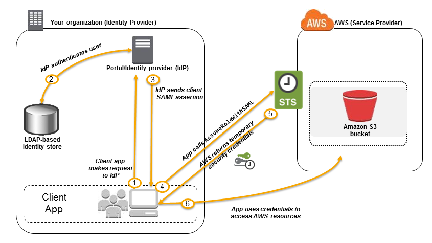

![[Pasted image 20221031093528.png]]
# [[IAM]] Identity Center

## TLDR
Similar to [[Cognito]] but for access and auth to AWS itself, rather then Applications running in AWS. Known before as AWS SSO
- If there is already enterprise MS AD => AWS AD connector and AWS SSO
- use alongside with Organizations for enterprise SSO to AWS(similar to log in to Openshift using enterprise accounts)
## Feature
- One Login SSO for all your AWS Accounts
- SSO for business cloud application
- Support SAML2.0 enabled applications
- Can be used to grant access to [[EC2]] Windows Instances (remote working PCs)

## Identity Providers
- Built-in identity store in [[IAM]] Identity Center
- 3rd party, AD, One Login ...
## Identity provider federation

## Identity providers: MS ADFS vs Web Identity Federation
- MS ADFS is for Active directory
- WIF: wellknown public IdP, e.g Amazon, FB, Google
- 