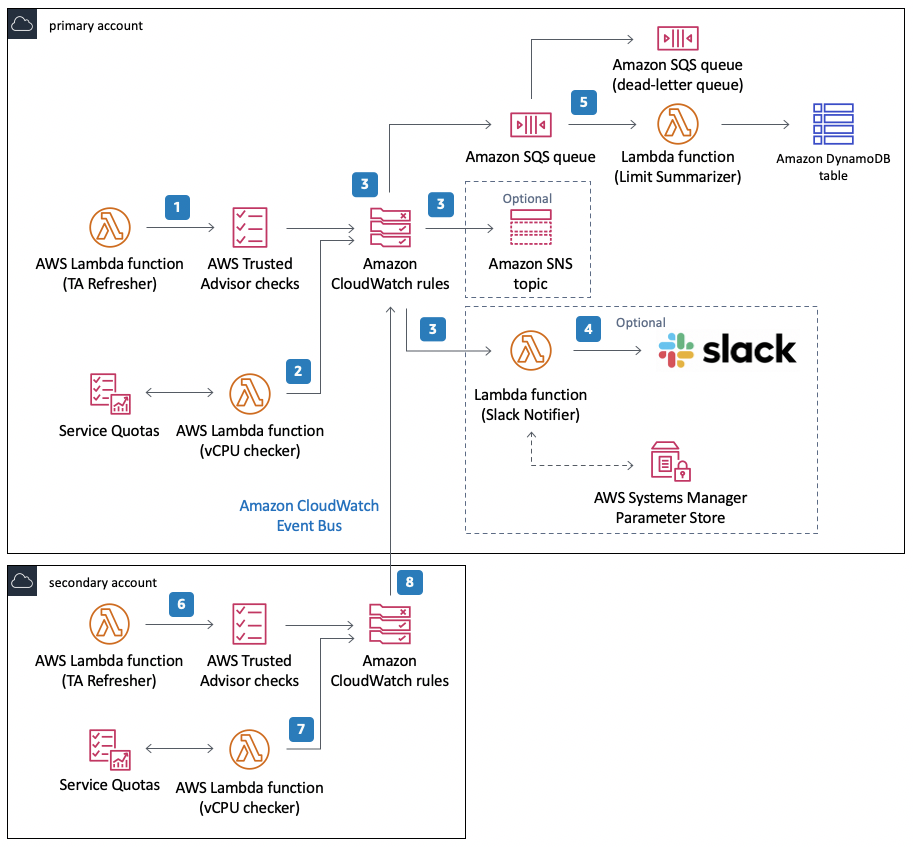

![[Pasted image 20221031095825.png]]
#  Trusted Advisor

## TLDR
Dashboard and Service to check the configuration and pricing of your AWS Account. Can be customized and trigger alarms or warnings.

## Use Cases
- Checks if reserved instances are schedules to expire and warn the user, but the service **cannot** renew the reservation

## Limit Checks
- will need a trigger to run the limit check, e.g. Lambda
- can integrate with cloudwatch events(event bridge) to send to targets(sns,lambda) for further processing
- Used for Quota Monitoring Across Multi Accounts.

## vs AWS Config
- Trust advisor doesn't have config rules, just provide best practices 
## vs Well architecture tool
- WAT provides comprehensive views that align with pillars, one time thing like a house inspector
- Trusted advisor provides real time check (once per week) and immediate recommendations, like a friend who could help check your house frequently