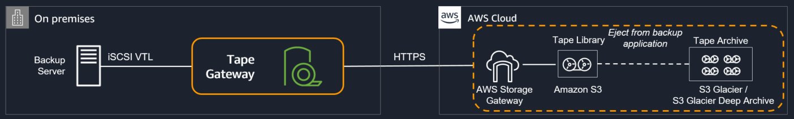

![[Pasted image 20221031110419.png]]
# Storage Gateway

## TLDR
Can be used for a hybrid cloud setup, where data is produced on premise and synced to aws.

## Usage
- long term migrations
- security
- complicance
- general IT strategy (hybrid cloud)
- tiered storage
- backup and restore
- disaster recovery

## Gateway Types

### [[S3]] File Gateway
- NFS or SMB Protocol
- Translates save file request to http request to [[S3]]
- Most recently used data is cached in file gateway, so it doesnt have to be fetched from aws
- Use cases for Amazon S3 File Gateway include: 
  - (a) migrating on-premises file data to Amazon S3, while maintaining fast local access to recently accessed data, 
  - (b) backing up on-premises file data as objects in Amazon S3 (including Microsoft SQL Server and Oracle databases and logs), with the ability to use S3 capabilities such as lifecycle management and cross region replication, and, 
  - (c) hybrid cloud workflows using data generated by on-premises applications for processing by AWS services such as machine learning, big data analytics or serverless functions.

### FSx File Gatway
- Native access to [[FSxWindowsFileServer]]
- Local cache for frequently accessed data
- Windows native compatiblity (SMB, NTFS, AD)
- Group file shares and home directories

### Volume Gateway
- Block Storage
- Backed by [[EBS]] snapshots
- iSCSI

#### Cached volumes
- low latency access to most recent data

#### Stored volumes
- dataset on premise, backups are schedules to [[S3]]

### Tape Gateway
- uses iSCSI virtual tape library (VTL) 
- for backup processes using physical Tapes
- can send directly into [[S3]] Glacier

## Hardware appliance
- Can be bought from amazon.com
- Is a harware which will be your gateway (like a firewall)

### vs EBS/EFS/FSx
- storage gateway may be used with hybrid, when workload is located on-prem
- Others: require workload to be on AWS

### SMB vs NFS
- Both Used with file gateway
- SMB: support cross platform as natively supported by Windows
- NFS: only on Linux