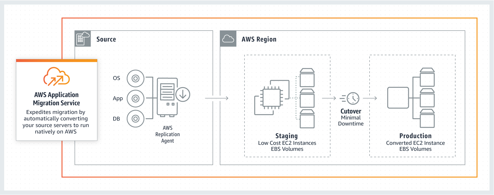

![[Pasted image 20221031102804.png]]
# AWS Application Migration Service

## TLDR 
Is a service similar to [[DMS]] but it migrates Applications instead. Lift and shift solution. Allows to move on-prem, containers or other cloud-based solutions to AWS easily and with little manual work (too good to be true?)
Free for 90 days.

## Features
- Rehost solution which simplfies migration applications to aws
- Converts your physical, virtual and cloud-based servers to run natively on AWS
- Data agent on premise side does continues repliaction into the cloud
- Supports a range of platforms, OS and databases