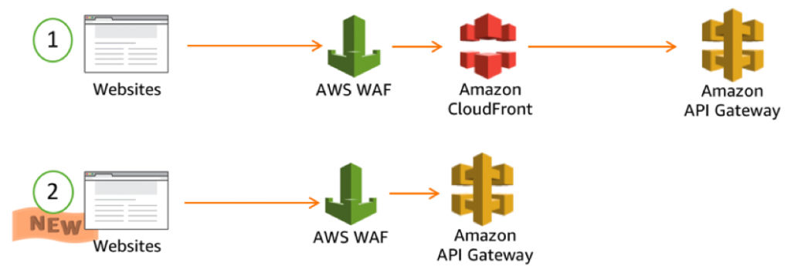

![[Pasted image 20221101171725.png]]
# Web Application Firewall
- protection against layer 7 exploits (http)

## Deploy Targets
- ALB [[ELB]]
- [[APIGateway]]
- [[Cloudfront]]
- AppSync GraphQL API
- [[Cognito]] User Pool

## Web ACL
- up to 10k ips per set/rule
- http heade
- http body
- uri strings
- size constraints
- geo matching
- rate based rules
- rules are region, for [[Cloudfront]] they are global
## vs AWS Network Firewall
AWS Network Firewall (Level 4): Operates at the network layer (Layer 4) of the OSI model. It deals with IP addresses, protocols, and ports. This is commonly known as a stateful firewall, where filtering decisions are made based on information at the transport layer.

AWS WAF (Level 7): Operates at the application layer (Layer 7) of the OSI model. It focuses on inspecting and filtering traffic at the HTTP/HTTPS level, dealing with web-specific protocols and payloads. This is commonly known as a Web Application Firewall (WAF).
