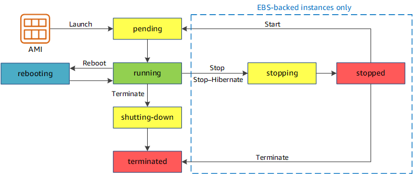

 # EC2 Instance Store

- hardware disk, lower latency than ebs
- better IO performance
- Data will be lost if instance is stopped (ephemeral)
- Good for buffer, cache, scratch data, temporary content
- Hardware fail loses data
- Backup and Replication recommended (manual)

## Behavior
There are 2 separate topics, 1 is `instance store` EC2 type and the other is EBS-backed EC2 type(based on root fs)
For  `instance store` EC2 type:
- When rebooted: still available, EIP still attached to instance
- Cannot be stopped, can only be rebooted or terminated
For EBS-backed EC2 type
- Instance store deleted when reboot
- The EC2 can move to other host
- The EIP and ENI still attached to the instance. Note for EC2 classic, EIP will be detached
