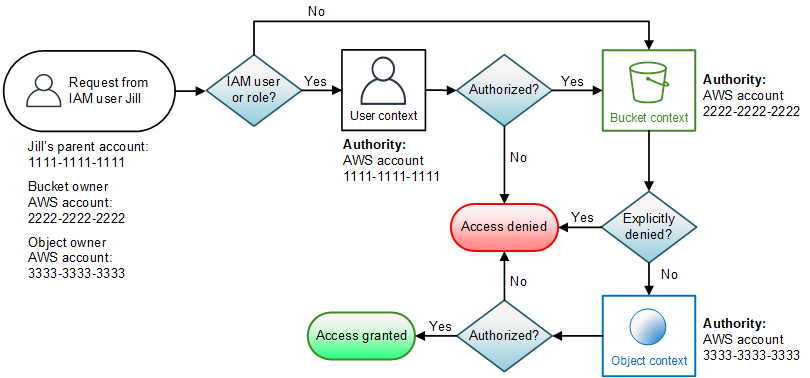

![[Pasted image 20221101113016.png]]
# Amazon S3

- object based storage
- max storage 5 TB
- if uploading more than 5gb use multi upload
- also has metadata, tags and optional version id
- read after write consistency
- 3,5k writes and 5k puts per second


## Requester Pays
- Requester pays network and downlaod cost
- use to share large data sets with other accounts
- user must be autherized in aws 

## S3 event notifications
- trigger an action (lambda) on api request to the bucket
- can also use event bride for more targets and filters

### Targets
- [[Lambda]]
- [[SNS]] 
- [[SQS]]
- can take more than 1 min to trigger

## S3 Access Logs
- monitor traffic requests to an S3 bucket
- can be used for access and security audits
- helps understand s3 bill

## MFA-protected API Access
- enforce MFA for access to S3 resources

## MFA delte
- enforce MFA for delete object action

## Versioning
- if an object is updated the old version still persists within the bucket
- if an object is deleted the new version will be a delete marker, and the old version will still persist within the bucket

## Commands 

### S3 Sync
- copies objects between buckets
- does diff
- used last modified to update
- if versioned only copies current version
```bash
aws s3 sync s3://DOC-EXAMPLE-BUCKET-SOURCE s3://DOC-EXAMPLE-BUCKET-TARGET
```

## Storage Tiers
- can transition to infrequent access only after 30 days

### Glacier
- some applications can save data directly into Glacier (e.g. Tape gateway, data sync) , you can also do this manually by using cli
- snowball transfer cannot be directly inserted only transfered from default tier
- low cost but higher retrieval cost and time
- retrieve within 12 hours
### Archive select
- SQL against archive data
#### Expedited Retrival
- 1 to 5 minutes of retrieval time 
- requires provisioned Retrieval Capacity
#### Standard retrieval
- 3-5 hours, not going with provisioned retrieval capacity
#### Bulk retrieval
- 5-12 hours, not going with provisioned Retrieval Capacity
#### Range retrieval
- A portion or archive, not going with provisioned retrieval capacity
#### Provisoned Retrival Capacity
- guranteed up to 150mbs retrival speed

#### Glacier Deep Archive
- 75% cheeper than Glacier
- higher retrieval feed than glacier
- no expedited retrieval
- can retrieve at lower fee using bulk retrieve but this will take 48 hours

### Infrequent Access
- less freq access, but instantly available
- low per GB Storage price
- retrival fee

### One Zone / One Zone IA
- single AZ storage 20% less cost

## Lifecycle Rules

### Transiton Actions
- move to different storage tier after time
- can transition to infrequent access only after 30 days

### Transfer Limitations for Lifecycle Rules
![[Pasted image 20221101123650.png]]

### Expiration Actions
- delete access logs
- delete old versions of files
- delete incomplete multi part uploads
- can apply to paths or full bucket

## Tranfer Accelerator
- fast transfer over long distances
- uses cloudfront edge locations
- routes via optimized path

## Multipart uploaads
- transmit object in chuncks
- if one chunk fails, only that chunk needs to be retransmitted
- over 100mb should be considered
- improved throughput

## S3 Bucket Policies
- add or deny permissions to objects
- can be attached to users groups or buckets
- can grant access to other aws accounts
- can restrict based on multi coditions for the requets (ip, time, ssl)

## ACL
- can also use ACL to grant another account access

## Encryption

### SEE S3
- Server Side encryption of objects 
- aws managed
- replication by default

### SEE C
- Server Side encryption
- customer managed keys
- objects can not be replicated

### SSE KMS
- Need to specify need key for object in new bucket
- need iam role to decrypt with source key and encrypt with new key
- might get [[KMS]] throttling errors, need to ask for service quotas increase
- can use multi region kms keys 

### Client Side Encryption
- Encrypt before upload and decrypt after download using own mechanism

## Replication
- must have versioning in both buckets
- can be cross region or same region
- can be bucket in other account
- async
- use batch replication to replicate existing ones
- cant chain replication

### Use cases
- compliance
- latency
- replication across accounbts
- log aggregation
- sync data to test account from prod

## Performance
- 100-200ms
- 3,5k put copy post delte per prefix
- 5,5k read per prefix
- use multi part upload for parallell upload
- transfer accel to upload to edge location instead of directyl to s3, also use for dl if files are bigger than 1GB
- byte range fetches -> multi part download

## Select
- filter data server side to reduce network cost (100 lines out of 1 mil lines csv)

## Batch operations
- modify all metadata and properties
- copy objects between buckets
- encrypt all unencrypted objects
- modify acl and tags
- restore objects from glacier
- invoke lambda for each object
- use s3 select to filter then batch

## Vault
- Objects can not be modified or deleted
- used for compliance
- Can lock the vault policy from future edits

## Server Access Logging
- If [[CloudTrail]] is not enough information you use this

### Features
- including referer
- including turn around time

## Bucket policies vs ACLs
- Bucket Policy:

Use when you want to set general rules for the entire bucket.
Useful for scenarios where a broad stroke of access control is sufficient.
- ACL:

Use when you need specific rules for individual objects within the bucket.
Useful when certain objects need different levels of access.
  

Account policies, User policies, bucket policies, bucket ACLs, and object ACLs all overlap.

Explicit DENY in any of these trump explicit ALLOW found anywhere else. An explicit ALLOW in any of these trump implicit DENY rules.

Example: Bucket ACL says allow user A, but bucket policy says DENY user A. The deny will trump the allow.


## Bucket policies vs access points
### Access Points:

Use Access Points when you want different rules for different parts of your storage. It's like having separate entrances for each section of your "mall."

Access Points for Transfer Acceleration: Specialized entry points on the fast highway for optimized large file transfers, accessible globally.


### Regular S3 Access Points and Access Points for Transfer Acceleration

- Custom Entrances:

Both regular S3 Access Points and Access Points for Transfer Acceleration provide a way to create custom entrances or entry points with specific rules.

- Isolation and Configuration:

They allow you to isolate and configure access to specific parts of your storage (regular Access Points) or optimize transfers (Access Points for Transfer Acceleration).

- Organized Access:

Just like having different entrances for different sections of a mall makes it organized, having specialized entry points for certain types of access or transfers makes the AWS S3 environment organized and easier to manage.


Bucket Policies:

Use Bucket Policies when you want general rules for the entire storage. It's like posting overall guidelines at the main entrance of your "mall."

## Connect s3 access point from VPC
- Create a VPC-only Access Point for the Amazon S3 bucket. This makes sure that this Access Point can only be accessed by resources in a specific VPC.
- Create Amazon S3 gateway endpoint in the VPC and add a VPC endpoint policy. This VPC endpoint policy will have a statement that allows S3 access only via access points owned by the organization. We take advantage of the account ID in the Access Point ARN to make this possible.
- Add a bucket policy on the bucket to allow access only from the VPC: This prevents any access from outside the VPC.

## Retention vs Legal hold for deletion(used with WORK)
- independent from each other
- any valid retention or legal hold will make sure object is untouchable
- retention can be set with time, legal is like a label, can be placed and unplaced

## Compliance vs governance for WORM
- compliance doesn't allow any to change, governance allows users with permission to change