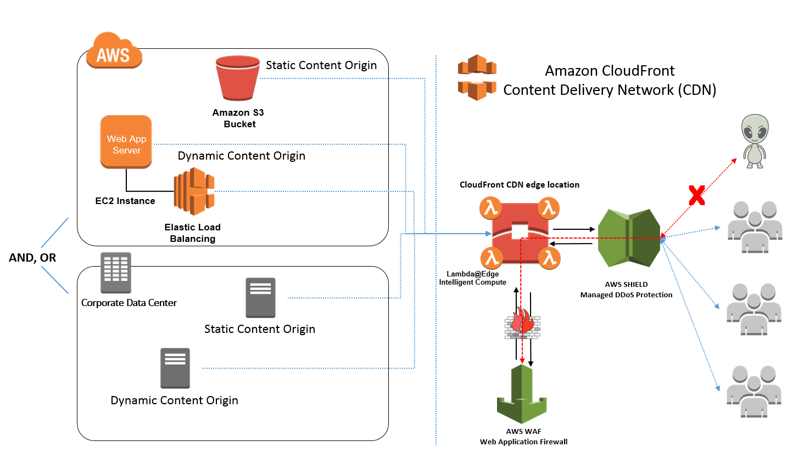
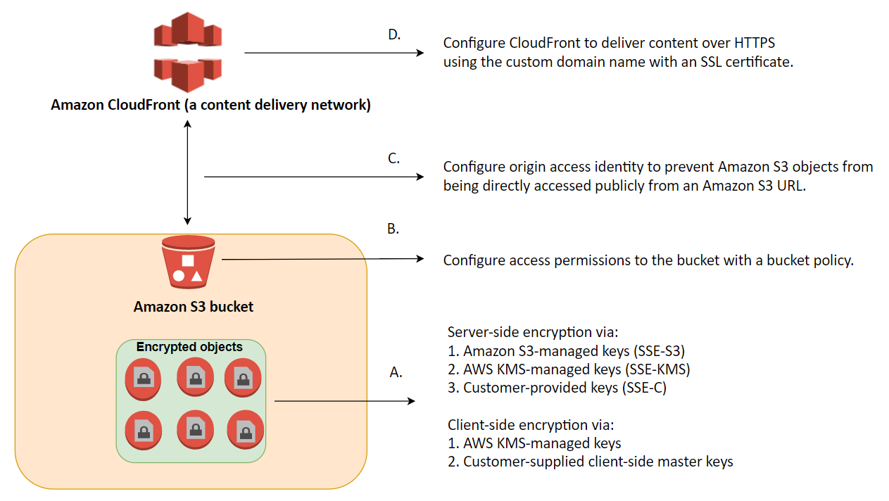
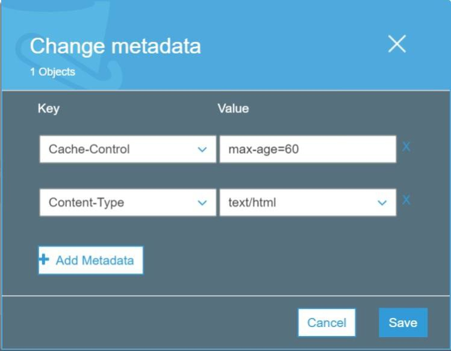

# CloudFront
- CDN
- data, videos, application and apis delivery
- global
- regional edge cachhes
- only http based requests

## Origins

### [[S3]]
- caching
- distributoing
- enhanced securty with (OAI)
- Cloudfront can be upload point to S3

### Custom Endpoint
- [[ELB]] ALB
- [[EC2]]
- [[S3]] Website
- Any HTTP backend

## Geo Restirction
- whitelist countries
- blacklist coutries
- use for copyright laws

## Price Classes
- depends on data transfer, but is diffrent for each edge location
- price goes down if you transfer more data

### All
- all regions - best performance - highest price

### 200
- most regions - exludes most exp

### 100
- only cheapest regions 

## Cache Invalidations
- invalide via api and path

## Customization at Edge
- serverless
- customize a cdn endpoint
- pay per use

### Use cases
- Website security and privacy
- seo
- intelligent route
- bot mitigation
- real time image transform
- a/b testing
- Dynmaic Web Apps at Edge
- User prio
- tracking ad analytics
- user auth 

### Cloudfront Edge function
- code attached to cloudfront distributions
- runs closer to users for min latency
- lightweight written in js
- high scale latency senstive cns customisations
- sub ms startuptimes
- managed in cloudfront
- millions of request per second

#### Price
- Free tier available
- 1/5 of [[Lambda]] @Edge

#### Use cases
- cache key normalisation (transform request attributes)
- header manipulation
- url rewrites and rediect
- validate jwt tokens

### [[Lambda]] at Edge
- nodeJs or python
- 1ks of request per second
- can change every part of the request (viewer and origin)

#### Price
- no free tier

#### Use cases
- loner exec time
- adjustible cpu memory
- code depends on 3rd party (AWS CLI)
- Network access
- File System Access
- Http Body Access

## Availability
- can setup origin failover
- an origin group may have a primary and a secondary origin


## Host s3 static files that are not publically accessible

## Note
- cannot use autoscaling group as origin, but can use load balancer which can interract with autoscaling group
- failover require 2 running stacks, 1 is primary and the other 2ndary standby

## [Invalidating cache strategy](https://docs.aws.amazon.com/whitepapers/latest/build-static-websites-aws/controlling-how-long-amazon-s3-content-is-cached-by-amazon-cloudfront.html)
- Set Minimum TTL and Maximum TTL specs on Cloudfront
- Set metadata Cache-Control: max-age=[seconds] on S3 objects

- User versioning, each version has a different link. Can use S3 object version
```java
    S3Properties s3Properties... // Custom properties pulled from a config file
    String cloudfrontUrl = "https://" + s3Properties.getCloudfrontDomain() + "/" + 
            documentS3Key + "?versionId=" + documentS3VersionId;

    URL cloudfrontSignedUrl = new URL(CloudFrontUrlSigner.getSignedURLWithCannedPolicy(
            cloudfrontUrl,
            s3Properties.getCloudfrontKeypairId(),
            SignerUtils.loadPrivateKey(s3Properties.getCloudfrontKeyfilePath()),
            getPresignedUrlExpiration()));
```
- Use CloudFront invalidation requests(send request to Cloudfront to force the invalidation) => may take time