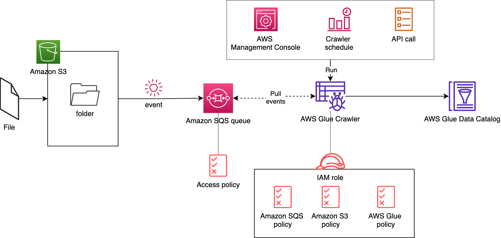

# AWS Glue
- ETL Service
- serverless

- perpare and load data for analytics

## Job Bookmarks
- prevent reproccessing old data
- start where left off in case of interrupted or fails for any reason
- Job bookmarking works by storing the state of a job's progress in a persistent data store separate from the job itself. 
## Views
- combine and replicate data across multiple data stores with sQL
- uses a virtual table

## Data Brew
- clean and normalize data using pre build transform

## Glue Station
- new GUI to create run and monitor ETL jobs

## Streaming ETL
- compatible with kinesis
- kafka
- MSK
## vs AWS EMR
- choose Glue over EMR for ETL as it's serverless and ETL specific
- Choose EMR if big data tasks more than ETL are required
## vs Flink Studio
- Flink studio is for streaming data
## Triggering
- Event(e.g. SQS): use for realtime processing
  
- Scheduled
  